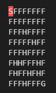

# OpenAI gym with Stable Baslines 3

The goal of the project was to create and learn agent plays Atari game.
The research was done on enviromnent [FrozenLake 8x8-v0](https://gym.openai.com/envs/FrozenLake8x8-v0/) with episodical reward. 
Full list of available environments you can find on [OpenAI gym website](https://gym.openai.com/envs/).
The agent implementation was taken from [Stable Baselines 3](https://stable-baselines3.readthedocs.io/en/master/#) library.

All information about experiments (model parameters, achived results in training and evaluating phase, tensorboard log, gameplay record, trained model) in directory `reports` (with the use of mlflow and tensorboard).
Trained models are saved in folder `models`.


## FrozenLake 8x8 game

The game is represented by 8x8 characters board. 




The target of game is to get from start point (S) to goal point (G) avoiding holes (H). Frozen places (f) are safe. Red square incidates current player poisiion.   
There are 4 available moves: left (0), down (1), right (2), up (3). 

The reward is **episodical**. Reward 1 means winning - the agent arrives to goal point. In any other case, reward 0 is returned.  

The environment may be executed in **deterministic** as well as **stochastic** mode.

In stochastic one there are probabilistic transitions between states. It simulates a slippery surface. In other words, even when our agent chooses to move in one direction, the environment can execute a movement in another direction.

Stochastic mode is set in default, but deterministic one can be turned on setting parameter `is_slippery=False` while enviroment is created. 


## Example

In notebook *Frozen_Lake_game* you can find example of training and testing RL algorithms: PPO, A2C and DQN.


## Installation

### Prerequisites:
* Python 3.6+

To install all necessary packages run command:
```
pip install -r requirements.txt
```
To see full expriment results open `mlflow` ui in your console: 
```
cd reports\
mlflow ui
```

**Note:** The solution was tested only in Windows system. 
